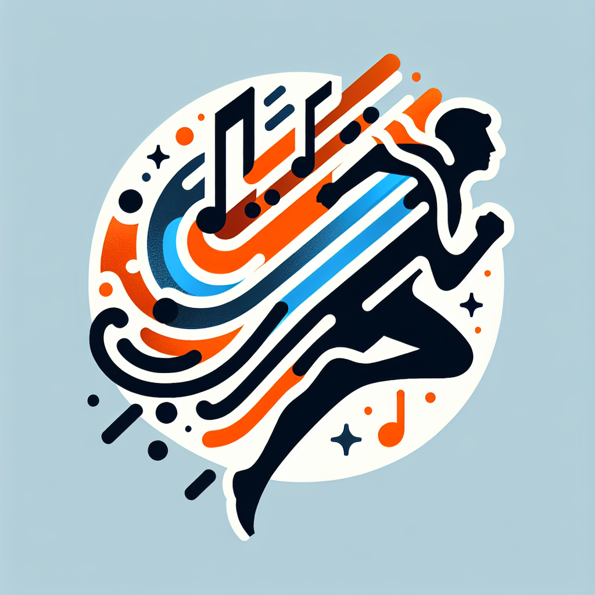

# Running Mate

### Features

- Real-time tracking of running statistics such as cadence, speed, time, calories, and steps.
- Step Counting while Running (Step counting is optimized for running and will not properly work while just walking)
- Integration with OpenEarable devices for sensor data.
- GPS tracking for distance and speed calculation.
- Audio feedback from OpenEarable based on running cadence.
- Customizable settings for step length, goal cadence, weight, and sensitivity.

### Setup Music on SD Card
see [Music.md](assets/music.md)
